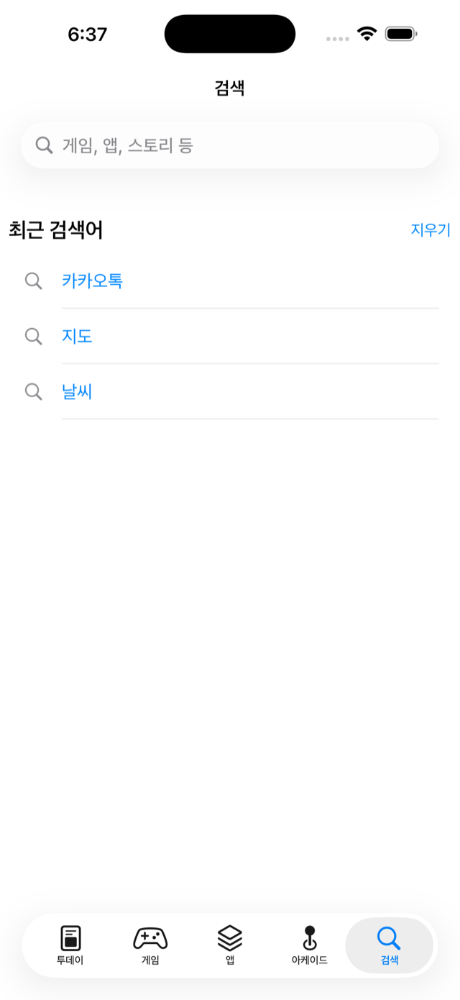
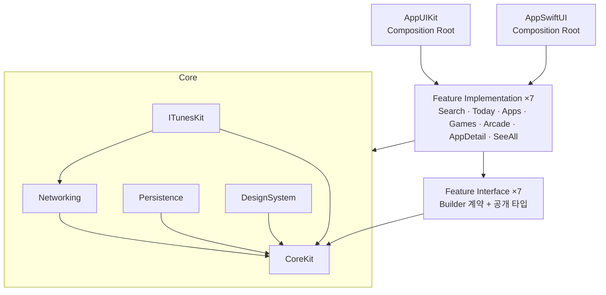

# My AppStore

애플 App Store를 클론한 iOS 앱입니다. 실제 iTunes 공개 API로 동작하며, 피처 단위의 모듈러 아키텍처로 구성했습니다.

     

| 투데이 | 게임 | 앱 | 아케이드 | 검색 |
|---|---|---|---|---|
|  |  |  |  |  |

## 아키텍처

### 피처당 4타깃

피처 하나를 4개의 타깃으로 구성했습니다. 팀 단위 분업을 전제로 한 구조입니다.

```
Feature/Search/
├─ SearchInterface   진입 계약(Builder 프로토콜)만 노출 — 거의 바뀌지 않아 빌드 캐시 적중률이 높습니다
├─ Search            실제 구현(Domain/Data/Presentation). App만 참조합니다
├─ SearchTesting     계약 Mock — 다른 피처가 이 피처의 구현 없이 개발/테스트할 수 있습니다
└─ SearchExample     피처 단독 실행 데모 앱 — 오프라인 픽스처 스텁으로 네트워크 없이 구동
```

### 앱 타깃 2개 — UIKit / SwiftUI

같은 피처 위에 두 개의 Composition Root 를 얹었습니다. **공유하는 것은 Presentation 아래 전부**(Domain · Data · ViewModel)이고, 각 앱이 소유하는 것은 View 와 조립뿐입니다.

```
AppUIKit      5탭 전부 UIKit — UITabBarController + UINavigationController
AppSwiftUI    SwiftUI 라이프사이클. 검색 탭은 네이티브 SwiftUI(마이그레이션 완료),
              나머지 4탭은 UIViewControllerRepresentable 인터롭으로 공존
```

점진적 마이그레이션을 전제로 했습니다. 한 탭을 SwiftUI 로 옮기는 동안 나머지 탭은 기존 UIKit 화면을 그대로 호스팅하므로, 앱은 어느 시점에도 동작합니다.

### 의존 방향



- **피처는 다른 피처의 구현을 import하지 않습니다.** 다른 피처가 필요하면 그 피처의 `*Interface`(계약)만 의존하고, 구현체는 App(Composition Root)이 주입합니다 — 피처 간 직접 결합이 없습니다.
- **공용 Domain 모듈을 두지 않았습니다.** 피처 경계를 원시 타입(`build(appID: Int)`)만 넘기 때문에 엔티티·UseCase·Repository는 피처가 소유합니다. 화면마다 필요한 필드만 가진 엔티티를 쓰고, 전 피처가 공통으로 반복하는 iTunes 응답 디코딩(DTO)만 `ITunesKit`으로 모았습니다.
- god-router 대신 **계약 주입**을 사용합니다. 각 피처가 자기 진입 계약을 노출하고 필요한 쪽이 주입받아, 어느 피처가 무엇을 호출하는지 타입으로 드러납니다.
- Core 모듈도 피처와 동일하게 **모듈별 독립 프로젝트**로 분리해 소유권과 매니페스트를 나눴습니다.

### 피처 내부 — 클린 아키텍처

```
Sources/Search/
├─ Domain/          엔티티 · UseCase · Repository 프로토콜 (순수 Swift)
├─ Data/            Mapper(DTO→엔티티) · Repository 구현 (ITunesKit 사용)
└─ Presentation/    ViewModel(@Observable, UI 비의존) · View(UIKit) · Builder(조립)
```

계층 경계는 컨벤션에 그치지 않고 **SwiftLint 커스텀 룰로 검증합니다** — `Domain/` 폴더에서 `import UIKit`/`import ITunesKit`/`import Networking`은 lint error입니다.

의존은 **필요한 만큼만** 좁힙니다. `ITunesClient` 전체를 넘기지 않고, AppDetail·Today·Arcade는 `AppLookup`만, Search는 `AppSearching`만, SeeAll은 `ChartFeeding`만 주입받습니다. 덕분에 각 피처의 테스트 목도 쓰지 않는 메서드를 구현하지 않습니다.

### 데이터 흐름

```
View ──행동──▶ ViewModel ──▶ UseCase ──▶ Repository(프로토콜) ──▶ ITunesKit / Persistence
  ▲                │
  └── @Observable ─┘        모든 I/O는 async/await · Swift 6 strict concurrency
```

- ViewModel은 `@Observable` + `@MainActor`이며 UIKit/SwiftUI를 import하지 않습니다. **검색·앱 상세를 SwiftUI로 옮길 때 ViewModel은 수정하지 않았습니다** — UI 비의존 설계가 실제로 검증된 지점입니다. 그 과정에서 유일하게 필요했던 변경은 ViewModel이 참조하던 표시 문자열(`CommonStrings`)을 `DesignSystem`에서 `CoreKit`으로 옮긴 것이었습니다.
- UIKit에서의 관찰은 `withObservationTracking` 재귀 재등록 유틸(`ObservationSubscription`)로 처리합니다. SwiftUI는 `@Observable`을 그대로 추적하므로 이 유틸이 필요하지 않습니다.

## 모듈 구성

| 계층 | 모듈 | 책임 |
|---|---|---|
| App | `AppUIKit` | 유일하게 모든 구현을 아는 조립 지점 — DI 등록, Builder 계약 주입, 탭 구성 |
| | `AppSwiftUI` | 같은 역할의 SwiftUI 조립 지점 — `NavigationStack` 라우팅 소유, 미마이그레이션 탭은 UIKit 인터롭 |
| Feature ×7 | `Search` `Today` `Apps` `Games` `Arcade` `AppDetail` `SeeAll` | 각자 Interface/Impl/Testing/Example 4타깃 |
| Core | `CoreKit` | StoreConfig, 공통 에러, 표시 문자열, ImageLoading 계약 (UI/네트워크 비의존) |
| | `Networking` | HTTP 추상화 — iTunes를 모르는 범용 계층 |
| | `ITunesKit` | iTunes API 공용 DTO + 클라이언트. 계약을 `AppSearching`/`AppLookup`/`ChartFeeding` 으로 나눠 각 피처가 쓰는 것에만 의존합니다 |
| | `Persistence` | TTL 캐시(메모리+디스크), 이미지 로더, 최근 검색어 |
| | `DesignSystem` | UIKit 컴포넌트 — 피처 엔티티를 모르는 구성 모델 입력 |

## 빌드 — 모듈 분리가 실제로 만든 차이

모듈화의 이득은 주장이 아니라 측정으로 확인해야 합니다. 변경 지점을 의존 그래프의 서로 다른 깊이에 두고, **재컴파일되는 모듈 수**를 재봤습니다.

| 변경 지점 | 재컴파일 모듈 | 빌드 시간 |
|---|---|---|
| 클린 빌드 (전체) | 20 | 20s |
| `CoreKit` 공개 API 추가 — 최하위, 전 모듈이 의존 | 13 | 13s |
| `AppDetailInterface` 공개 API 추가 — 5개 피처가 의존하는 공유 계약 | 9 | 9s |
| `TodayInterface` 공개 API 추가 — 자기 피처와 App 만 의존 | 3 | 4s |
| `Today` 구현 내부(비공개) 수정 — **일상 개발** | 2 | 4s |
| 변경 없음 (no-op) | 0 | 3s |

- **일상적인 수정은 20개 모듈 중 2개만 재컴파일합니다.** 파급 범위가 그래프 깊이에 정확히 비례하며, 계약(`*Interface`)이 바뀌지 않는 한 하위 전파가 일어나지 않습니다 — Interface/Impl 분리가 값을 하는 지점입니다.
- 반대로 **모듈화의 비용도 같이 드러납니다.** 변경이 하나도 없을 때의 3초는 20개 모듈 그래프를 순회하는 고정 비용이고, 모듈을 더 쪼개면 이 하한이 올라갑니다.
- 이 규모(프로덕션 코드 약 9,500줄)에서 **절대 시간 이득은 크지 않습니다.** 모듈화가 갚는 건 코드가 늘어났을 때의 파급 범위이며, 위 표는 그 성질이 실제로 성립하는지를 보여주는 것입니다.

측정 환경 — Apple M1(8코어) · macOS 26.5.1 · Xcode 26.3 · iOS 26.3 시뮬레이터 · Debug · 격리된 `-derivedDataPath` · 각 시나리오 1회 측정(공백이 아닌 실제 공개 API 추가로 변경).

**아직 못 잰 것** — Tuist 바이너리 캐시 적중률. `tuist cache`(4.55.5)가 XCFramework 생성까지는 마치고 저장 단계에서 로그 파싱 오류(`Error parsing the log: Unexpected token parsing String`)로 실패합니다. 캐시가 비어 있어 캐시 적중 빌드는 측정하지 못했습니다.

## 데이터

인증이 필요 없는 애플 공개 API 3종을 사용합니다 (기본 `kr` 스토어):

- **iTunes Search API** — 키워드 검색
- **iTunes Lookup API** — 앱 ID로 상세 조회 (캐시 우선, 배치 조회)
- **Apple Marketing RSS** — 인기 무료/유료 차트

API에 없는 데이터(투데이 에디터 스토리, 아케이드 목록)는 정적 큐레이션 JSON + Lookup 조합으로 구성했습니다. 차트/추천 섹션은 **부분 실패를 허용**해 한 섹션이 실패해도 나머지는 렌더링됩니다.

## 테스트 — 153개

| 대상 | 방식 |
|---|---|
| UseCase | Repository 목 주입 — 비즈니스 규칙(트림/필터/부분 실패) 검증 |
| Mapper | 실제 API 응답 스냅샷 픽스처 — 안전 기본값 검증 |
| ViewModel | 상태 전이, 연속 요청 Task 취소, refresh 시 기존 데이터 유지 |
| Repository | 캐시 히트 시 네트워크 미호출 검증 |

Swift Testing을 사용하며, 네트워크·UI는 목/픽스처로 격리했습니다.

모듈별 — AppDetail 36 · Search 21 · SeeAll 16 · Persistence 15 · Today 12 · Apps 11 · Games 11 · Arcade 11 · Networking 10 · ITunesKit 10

## 실행

```bash
brew install mise && mise install        # tuist, swiftlint
tuist generate                            # .xcworkspace 생성 (생성물은 커밋하지 않습니다)
```

| 스킴 | 용도 |
|---|---|
| `AppUIKit` | 전체 앱 (UIKit) |
| `AppSwiftUI` | 전체 앱 (SwiftUI — 검색 탭 네이티브, 나머지 UIKit 인터롭) |
| `Search` 등 피처명 | 피처 빌드 + 유닛 테스트 |
| `SearchExample` | 피처 단독 데모 (오프라인 픽스처) |
