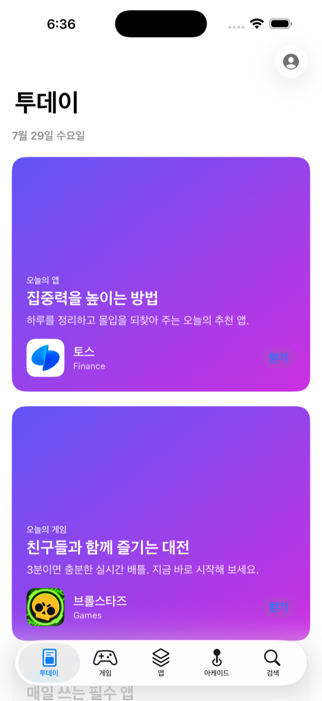
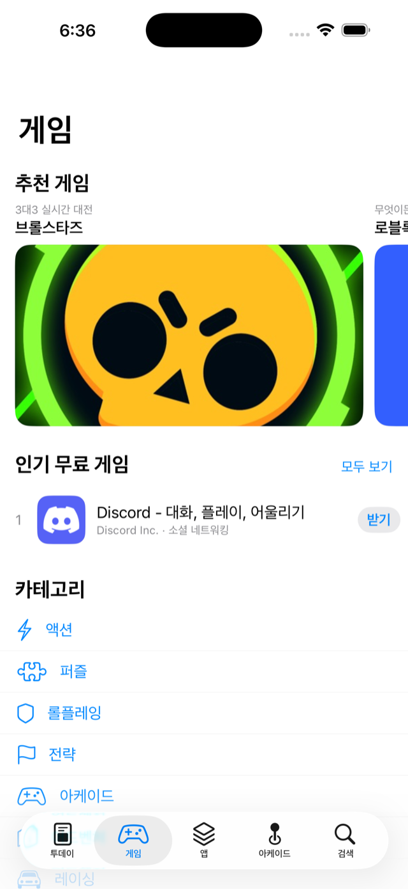
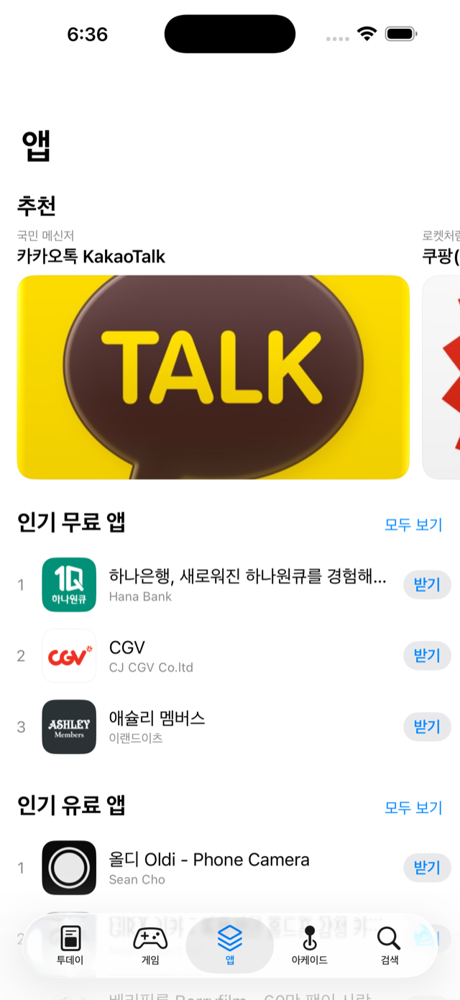
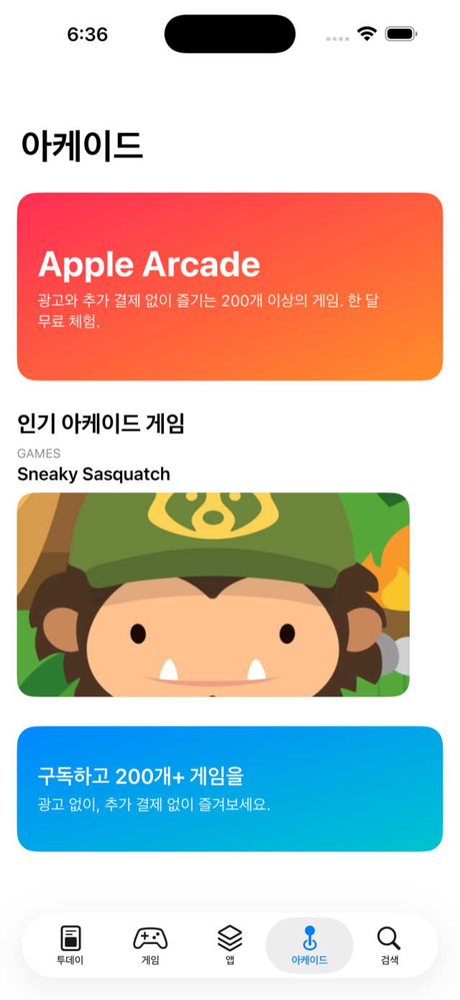
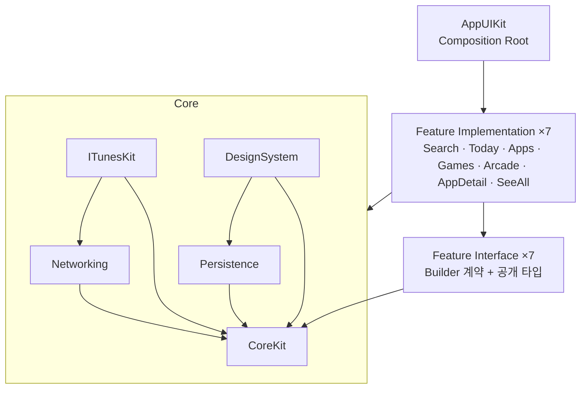

# My AppStore

애플 App Store를 클론한 iOS 앱. **대규모 모듈러 아키텍처를 교과서적으로 구현하는 것**이 목표이며, 실제 iTunes 공개 API로 동작한다.

    

| 투데이 | 게임 | 앱 | 아케이드 | 검색 |
|---|---|---|---|---|
|  |  |  |  |  |

## 핵심 설계

### 풀 모듈러 — 피처당 4타깃

피처 하나가 4개의 타깃으로 구성된다. 팀 단위 분업을 전제로 한 구조다.

```
Feature/Search/
├─ SearchInterface   진입 계약(Builder 프로토콜)만. 팀 간 합의 대상 — 거의 안 바뀜 → 빌드 캐시↑
├─ Search            실제 구현(Domain/Data/Presentation). App만 참조
├─ SearchTesting     계약 Mock. 타 피처가 Search 구현 없이 개발/테스트
└─ SearchExample     단독 실행 데모 앱 — 실 API / Mock(오프라인) 2개 스킴
```

### 의존 방향



- **피처는 다른 피처의 구현을 절대 import하지 않는다.** 다른 피처가 필요하면 그 피처의 `*Interface`(계약)만 의존하고, 구현체는 App(Composition Root)이 주입한다 — 피처 간 직접 결합 0.
- **공용 Domain 모듈이 없다.** 피처 경계를 원시 타입(`build(appID: Int)`)만 넘기 때문에 엔티티·UseCase·Repository는 전부 피처가 소유한다. 화면마다 필요한 필드만 가진 작은 엔티티를 쓰고, 전 피처가 반복할 수밖에 없는 iTunes 응답 디코딩(DTO)만 `ITunesKit`으로 공용화했다.
- god-router 대신 **계약 주입**: 각 피처가 자기 진입 계약을 노출하고 필요한 쪽이 주입받는다. "누가 무엇을 부르는지"가 타입으로 드러난다.

### 피처 내부 — 클린 아키텍처

```
Sources/Search/
├─ Domain/          엔티티 · UseCase · Repository 프로토콜 (순수 Swift)
├─ Data/            Mapper(DTO→엔티티) · Repository 구현 (ITunesKit 사용)
└─ Presentation/    ViewModel(@Observable, UI 비의존) · View(UIKit) · Builder(조립)
```

계층 경계는 컨벤션에 그치지 않고 **SwiftLint 커스텀 룰로 기계 검증**한다 — `Domain/` 폴더에서 `import UIKit`/`import ITunesKit`/`import Networking`은 lint error다.

### 데이터 흐름

```
View ──행동──▶ ViewModel ──▶ UseCase ──▶ Repository(프로토콜) ──▶ ITunesKit / Persistence
  ▲                │
  └── @Observable ─┘        모든 I/O는 async/await · Swift 6 strict concurrency
```

- ViewModel은 `@Observable` + `@MainActor`, UIKit/SwiftUI 어느 것도 import하지 않는다 (SwiftUI 전환 시 그대로 재사용).
- UIKit에서의 관찰은 `withObservationTracking` 재귀 재등록 유틸(`ObservationSubscription`)로 처리.

## 모듈 구성

| 계층 | 모듈 | 책임 |
|---|---|---|
| App | `AppUIKit` | 유일하게 모든 구현을 아는 조립 지점 — DI 등록, Builder 계약 주입, 탭 구성 |
| Feature ×7 | `Search` `Today` `Apps` `Games` `Arcade` `AppDetail` `SeeAll` | 각자 Interface/Impl/Testing/Example 4타깃 |
| Core | `CoreKit` | DI 컨테이너, StoreConfig, 공통 에러 (UI/네트워크 비의존) |
| | `Networking` | HTTP 추상화 — iTunes를 모르는 범용 계층 |
| | `ITunesKit` | iTunes API 공용 DTO + 클라이언트 (엔티티 없음 — 매핑은 피처 몫) |
| | `Persistence` | TTL 캐시(메모리+디스크), 이미지 로더, 최근 검색어 |
| | `DesignSystem` | UIKit 컴포넌트 — 피처 엔티티를 모른다(구성 모델 입력) |

## 데이터

인증 불필요한 애플 공개 API 3종 (기본 `kr` 스토어):

- **iTunes Search API** — 키워드 검색
- **iTunes Lookup API** — 앱 ID로 상세 조회 (캐시 우선, 배치 조회)
- **Apple Marketing RSS** — 인기 무료/유료 차트

API에 없는 것(투데이 에디터 스토리, 아케이드 목록)은 정적 큐레이션 JSON + Lookup 하이브리드로 구성. 차트/추천/캐러셀은 섹션별 **부분 실패 허용** — 한 섹션이 죽어도 나머지는 렌더된다.

## 테스트 — 127개

| 대상 | 방식 |
|---|---|
| UseCase | Repository 목 주입 — 비즈니스 규칙(트림/필터/부분 실패) |
| Mapper | 실제 API 응답 스냅샷 픽스처 — 안전 기본값 검증 |
| ViewModel | 상태 전이, 연속 요청 Task 취소, refresh 시 기존 데이터 유지 |
| Repository | 캐시 히트 시 네트워크 미호출 검증 |

Swift Testing 사용. 네트워크·UI는 목/픽스처로 격리.

## 실행

```bash
brew install mise && mise install        # tuist, swiftlint
tuist generate                            # .xcworkspace 생성 (생성물은 커밋하지 않음)
```

| 스킴 | 용도 |
|---|---|
| `AppUIKit` | 전체 앱 |
| `Search` 등 피처명 | 피처 빌드 + 유닛 테스트 |
| `SearchExample` | 피처 단독 데모 (실 API) |
| `SearchExample-Mock` | 피처 단독 데모 (픽스처 데이터, 오프라인) |

## 설계 문서

코드보다 문서를 먼저 확정하는 docs-first로 진행했다. [docs/](docs/)에 전체 설계가 있다 — 아키텍처 결정과 그 **이유**(공용 Domain을 두지 않는 이유, god-router를 버린 이유), 모듈 의존 매트릭스, 피처별 UI 스케치·상태 전이·엣지 케이스, API 명세(실응답과의 차이 포함).

## 로드맵

- [x] M0 프로젝트 골격 (Tuist 멀티 프로젝트 + 모듈 팩토리)
- [x] M1 Core 5모듈
- [x] M2~M5 피처 7개 수직 슬라이스
- [x] 피처별 Testing/Example 타깃
- [ ] M6 다듬기 — 스켈레톤/애니메이션/접근성, 게임 탭 로드 최적화
- [ ] M7 SwiftUI 버전 (동일 ViewModel 재사용)
